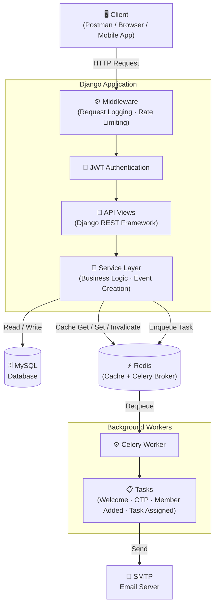
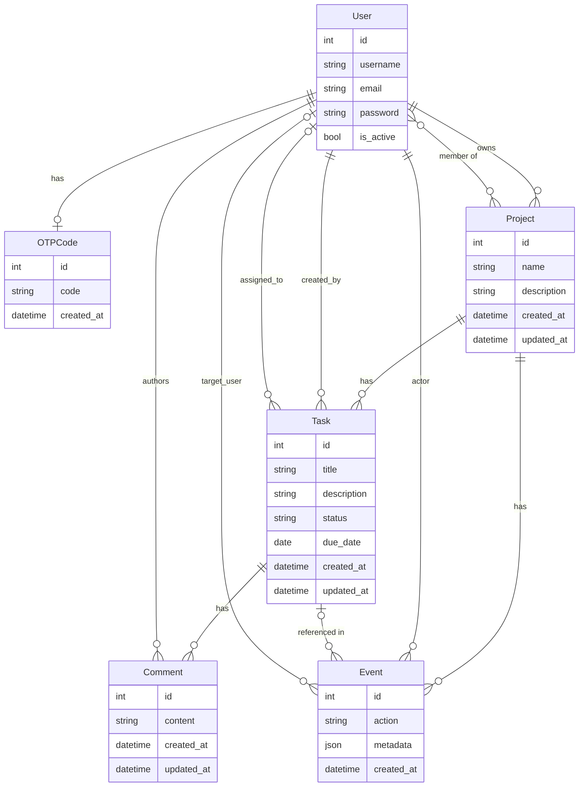

# DevBoard — A Production-Ready Project & Task Management API
> Most teams don't need a tool with hundreds of features they'll never touch.
>
> **DevBoard** is a clean, focused REST API for managing projects, collaborating with
> teammates, assigning tasks, and tracking progress — nothing more, nothing less.


[](https://www.python.org/)
[](https://www.djangoproject.com/)
[](https://www.django-rest-framework.org/)
[](LICENSE)
[](https://github.com/Bharat-Panchal15/DevBoard)
[](https://github.com/Bharat-Panchal15/DevBoard)


## Table of Contents

- [What is DevBoard?](#what-is-devboard)
- [Features at a Glance](#features-at-a-glance)
- [Architecture & Engineering Decisions](#architecture--engineering-decisions)
- [System Design](#system-design)
- [Data Models](#data-models)
- [API Reference](#api-reference)
- [Tech Stack](#tech-stack)
- [Project Structure](#project-structure)
- [Local Setup](#local-setup)
- [Environment Variables](#environment-variables)
- [Running Celery](#running-celery)
- [Running Tests](#running-tests)
- [What I Learned](#what-i-learned)
- [Roadmap](#roadmap)
- [License](#license)


## What is DevBoard?

Most task management projects are simple CRUD applications. DevBoard is different. It is an **API-first, production-grade backend** built as a rigorous environment for solving engineering problems that "starter" projects often ignore.


## Features at a Glance

| Feature Category | Implementation Details |
| :--- | :--- |
| **Authentication** | Secure JWT-based auth with token rotation, blacklisting, and 6-digit OTP email verification. |
| **Architecture** | Clean Service Layer pattern to decouple business logic from the API delivery layer. |
| **Performance** | Multi-level Redis caching, including a per-user cached dashboard for aggregated statistics. |
| **Background Jobs** | Celery + Redis broker for asynchronous email delivery (Welcome, Task Assigned, OTP). |
| **Security** | Tiered rate limiting (throttling) for Auth, Project, and Task endpoints to prevent brute-force and abuse. |
| **Audit Log** | Comprehensive Event-Sourcing model tracking project/task creation, membership changes, and status updates. |
| **Documentation** | Fully documented OpenAPI 3.0 schema with Swagger UI and Redoc integration. |
| **Reliability** | Production-standard logging across API, Django, and Error levels with file-based rotation. |


## Architecture & Engineering Decisions

### 1. Service Layer Pattern
**Problem:** Business logic bleeding into views makes code hard to test and reuse.

**What we did:** Every app has a dedicated `services.py`. Views only handle HTTP — request in, response out.

**Why:** A thin view can be tested with a simple API call. A fat view drags the entire HTTP stack into every test.

---

### 2. JWT + Token Rotation + Blacklisting
**Problem:** Standard JWT tokens can't be invalidated — a stolen token stays valid until expiry.

**What we did:** Enabled refresh token rotation and blacklisting via SimpleJWT. Every refresh issues a new pair and kills the old one.

**Why:** Logout becomes meaningful. A stolen refresh token can only be used once before it's dead.

---

### 3. OTP-Based Email Verification
**Problem:** Without verification, anyone can register with a fake or someone else's email.

**What we did:** New users are inactive by default. A 6-digit OTP is emailed — account activates only on successful verification.

**Why:** Guarantees every active user owns the email they registered with.

---

### 4. Celery + Redis for Background Tasks
**Problem:** Sending emails synchronously blocks the request — or fails it entirely if the mail server is slow.

**What we did:** All email operations (welcome, OTP, task assigned, member added) are offloaded to Celery workers via Redis.

**Why:** The API responds instantly. Email failures don't affect the user's experience.

---

### 5. Redis Caching
**Problem:** Dashboard and project list endpoints hit the database on every request — even when nothing changed.

**What we did:** Cached dashboard stats, project lists, and event lists in Redis (5-minute TTL). Cache invalidates on every relevant write.

**Why:** Repeated reads are free. Invalidation-on-write ensures users never see stale data.

---

### 6. Event Sourcing
**Problem:** Once data changes, the history is gone — no way to know who did what, or when.

**What we did:** A centralized `Event` model records every significant action with actor, timestamp, and structured metadata.

**Why:** Full audit trail without touching core models. Every state change is observable and accountable.

---

### 7. Tiered Rate Limiting
**Problem:** Auth endpoints are natural targets for brute-force attacks.

**What we did:** Custom throttle classes per endpoint — stricter on auth (`5/hour` OTP verify, `10/minute` login), looser on general usage.

**Why:** Blanket rate limiting is too blunt. Per-endpoint throttling protects sensitive surfaces without degrading normal usage.

---


### 8. Structured Logging
**Problem:** Without visibility into what the system is doing, debugging is guesswork.

**What we did:** `RequestLoggingMiddleware` logs every request with method, path, status, and duration. Three separate log files — `api.log`, `django.log`, `error.log`.

**Why:** When something breaks, the logs tell you exactly what happened, where, and who triggered it.


## System Design



## Data Models




## API Reference

> 📄 Full interactive documentation available at `/api/v1/schema/swagger-ui/` (Swagger UI) and `/api/v1/schema/redoc-ui/` (ReDoc).

### Auth

| Method | Endpoint | Auth | Description |
| :--- | :--- | :---: | :--- |
| `POST` | `/api/v1/register/` | ❌ | Register a new user |
| `POST` | `/api/v1/login/` | ❌ | Login with username or email |
| `POST` | `/api/v1/logout/` | ✅ | Blacklist refresh token |
| `POST` | `/api/v1/token/refresh/` | ❌ | Refresh access token |
| `POST` | `/api/v1/otp/verify/` | ❌ | Verify OTP and activate account |
| `POST` | `/api/v1/otp/resend/` | ❌ | Resend OTP to email |

### Projects

| Method | Endpoint | Auth | Description |
| :--- | :--- | :---: | :--- |
| `GET` | `/api/v1/projects/` | ✅ | List all projects for authenticated user |
| `POST` | `/api/v1/projects/` | ✅ | Create a new project |
| `GET` | `/api/v1/projects/{id}/` | ✅ | Retrieve project details |
| `PATCH` | `/api/v1/projects/{id}/` | ✅ | Update project (owner only) |
| `DELETE` | `/api/v1/projects/{id}/` | ✅ | Delete project (owner only) |

### Members

| Method | Endpoint | Auth | Description |
| :--- | :--- | :---: | :--- |
| `GET` | `/api/v1/projects/{id}/members/` | ✅ | List all project members |
| `POST` | `/api/v1/projects/{id}/members/` | ✅ | Add a member (owner only) |
| `DELETE` | `/api/v1/projects/{id}/members/{user_id}/` | ✅ | Remove a member (owner only) |

### Tasks

| Method | Endpoint | Auth | Description |
| :--- | :--- | :---: | :--- |
| `GET` | `/api/v1/projects/{id}/tasks/` | ✅ | List all tasks for a project |
| `POST` | `/api/v1/projects/{id}/tasks/` | ✅ | Create a new task |
| `GET` | `/api/v1/tasks/{id}/` | ✅ | Retrieve task details |
| `PATCH` | `/api/v1/tasks/{id}/` | ✅ | Update task (title, status, assignee) |
| `DELETE` | `/api/v1/tasks/{id}/` | ✅ | Delete a task |

### Comments

| Method | Endpoint | Auth | Description |
| :--- | :--- | :---: | :--- |
| `GET` | `/api/v1/tasks/{id}/comments/` | ✅ | List all comments for a task |
| `POST` | `/api/v1/tasks/{id}/comments/` | ✅ | Add a comment to a task |
| `DELETE` | `/api/v1/comments/{id}/` | ✅ | Delete a comment (author only) |

### Events

| Method | Endpoint | Auth | Description |
| :--- | :--- | :---: | :--- |
| `GET` | `/api/v1/projects/{id}/events/` | ✅ | List activity log for a project |

### Dashboard

| Method | Endpoint | Auth | Description |
| :--- | :--- | :---: | :--- |
| `GET` | `/api/v1/dashboard/` | ✅ | Get aggregated stats for authenticated user |


## Tech Stack

| Technology | Purpose | Why this one? |
| :--- | :--- | :--- |
| **Django 6** | Web framework | Batteries-included — admin, ORM, auth, migrations out of the box |
| **Django REST Framework** | API layer | The standard for building REST APIs in Django |
| **MySQL** | Primary database | Reliable, widely used in production, strong relational support |
| **SimpleJWT** | JWT authentication | Mature, well-maintained, supports rotation and blacklisting natively |
| **Redis** | Cache + message broker | Fast in-memory store — serves dual purpose without extra infrastructure |
| **Celery** | Background task queue | Industry standard for async task processing in Django |
| **django-environ** | Environment config | Clean `.env` based configuration, no hardcoded secrets |
| **django-filter** | Query filtering | Declarative filtering without cluttering views |
| **drf-spectacular** | API documentation | Auto-generates OpenAPI 3.0 schema with Swagger UI and ReDoc |
| **pytest + factory-boy** | Testing | Faster than Django's test runner, factories keep tests clean and readable |


## Project Structure

```
DevBoard/
├── requirements.txt          # Project dependencies
├── .env.example              # Environment variables template
└── devboard/
    ├── manage.py             # Django management utility
    ├── conftest.py           # Global pytest fixtures (user, project, api_client, auth_client)
    ├── pytest.ini            # pytest configuration
    │
    ├── config/               # Project-level configuration
    │   ├── settings.py       # All Django settings (DB, Redis, Celery, Logging, JWT)
    │   ├── urls.py           # Root URL configuration
    │   ├── celery.py         # Celery app initialization
    │   ├── middleware.py     # Request logging middleware
    │   └── pagination.py     # Global pagination configuration
    │
    ├── services/             # Shared cross-app services
    │   ├── events.py         # Centralized event creation logic
    │   ├── cache.py          # Cache invalidation helpers
    │   ├── email.py          # Email sending functions
    │   └── tasks.py          # Celery background task definitions
    │
    ├── users/                # Authentication & user management
    │   ├── models.py         # User + OTPCode models
    │   ├── services.py       # register, login, logout, OTP logic
    │   ├── views.py          # Auth endpoints
    │   ├── serializers.py    # Request/response serializers
    │   ├── permissions.py    # IsAnonymous permission
    │   ├── throttles.py      # Login, Register, OTP rate limiters
    │   └── tests/            # 30+ tests covering all auth flows
    │
    ├── projects/             # Project & member management
    │   ├── models.py         # Project + Event models
    │   ├── services.py       # create, update, delete, member logic
    │   ├── views.py          # Project & event endpoints
    │   ├── serializers.py    # Request/response serializers
    │   ├── permissions.py    # IsOwner permission
    │   ├── throttles.py      # Project, Member rate limiters
    │   └── tests/            # 25+ tests covering projects, members, events
    │
    ├── tasks/                # Task & comment management
    │   ├── models.py         # Task + Comment models
    │   ├── services.py       # create, update, assign, status, comment logic
    │   ├── views.py          # Task & comment endpoints
    │   ├── serializers.py    # Request/response serializers
    │   ├── permissions.py    # IsMember, IsAuthor permissions
    │   ├── throttles.py      # Task, Comment rate limiters
    │   └── tests/            # 30+ tests covering tasks, comments, services
    │
    ├── dashboard/            # Aggregated user statistics
    │   ├── views.py          # Dashboard endpoint with Redis caching
    │   └── urls.py           # Dashboard URL configuration
    │
    └── tests/
        └── factories.py      # factory-boy model factories for all apps
```


## Local Setup

### Prerequisites

Make sure you have the following installed:

- Python 3.13+
- MySQL
- Redis

> ⚠️ **Windows users:** Installing `mysqlclient` requires **Microsoft C++ Build Tools**.
> Download it from [visualstudio.microsoft.com](https://visualstudio.microsoft.com/visual-cpp-build-tools/)
> before running `pip install -r requirements.txt`.

### 1. Clone the Repository

```bash
git clone https://github.com/Bharat-Panchal15/DevBoard.git
cd DevBoard
```

### 2. Create & Activate Virtual Environment

```bash
python -m venv venv

# Windows
venv\Scripts\activate

# macOS / Linux
source venv/bin/activate
```

### 3. Install Dependencies

```bash
pip install -r requirements.txt
```

### 4. Configure Environment Variables

```bash
cp .env.example .env
```

Open `.env` and fill in your values. See [Environment Variables](#environment-variables) for reference.

### 5. Set Up the Database

Create a MySQL database:

```sql
CREATE DATABASE devboard;
```

Then run migrations:

```bash
cd devboard
python manage.py migrate
```

### 6. Run the Development Server

```bash
python manage.py runserver
```

API is now live at `http://127.0.0.1:8000/api/v1/`

> ⚠️ Celery and Redis must also be running for background tasks (emails) to work. See [Running Celery](#running-celery) below.


## Environment Variables

Copy `.env.example` to `.env` and fill in your values.

| Variable | Description | Example |
| :--- | :--- | :--- |
| `SECRET_KEY` | Django secret key | `your-secret-key-here` |
| `DEBUG` | Debug mode | `True` |
| `DB_NAME` | MySQL database name | `devboard` |
| `DB_USER` | MySQL username | `root` |
| `DB_PASSWORD` | MySQL password | `yourpassword` |
| `DB_HOST` | MySQL host | `localhost` |
| `DB_PORT` | MySQL port | `3306` |
| `REDIS_CACHE_URL` | Redis URL for caching | `redis://localhost:6379/1` |
| `REDIS_BROKER_URL` | Redis URL for Celery broker | `redis://localhost:6379/0` |
| `EMAIL_BACKEND` | Django email backend | `django.core.mail.backends.smtp.EmailBackend` |
| `EMAIL_HOST` | SMTP host | `smtp.gmail.com` |
| `EMAIL_PORT` | SMTP port | `587` |
| `EMAIL_USE_TLS` | Use TLS | `True` |
| `EMAIL_HOST_USER` | SMTP email address | `you@gmail.com` |
| `EMAIL_HOST_PASSWORD` | SMTP app password | `your-app-password` |
| `DEFAULT_FROM_EMAIL` | Sender email address | `DevBoard <you@gmail.com>` |
| `APP_LOG_LEVEL` | App logging level | `DEBUG` |
| `DJANGO_LOG_LEVEL` | Django logging level | `INFO` |
| `API_LOG_LEVEL` | API logging level | `INFO` |
| `ERROR_LOG_LEVEL` | Error logging level | `ERROR` |


## Running Celery

DevBoard uses Celery for background tasks (emails). You need **three terminals** running simultaneously:

### Terminal 1 — Redis Server (Memurai)

Memurai runs as a Windows Service and starts automatically in the background.
No manual start needed.

> ℹ️ **Windows users:** Install [Memurai](https://www.memurai.com/) for Redis compatibility on Windows.
> **macOS/Linux users:** Run `redis-server` in a separate terminal.

### Terminal 2 — Django Development Server
```bash
cd devboard
python manage.py runserver
```

### Terminal 3 — Celery Worker
```bash
cd devboard
celery -A config worker --loglevel=info --pool=solo
```


## Running Tests

DevBoard uses **pytest** with **factory-boy** for testing. The test suite covers authentication, project management, task management, comments, events, and service layer logic.

### Run the full test suite

```bash
cd devboard
pytest
```

### Run tests for a specific app

```bash
pytest users/tests/
pytest projects/tests/
pytest tasks/tests/
```

### Run a specific test file

```bash
pytest users/tests/test_login.py
```

### Run with verbose output

```bash
pytest -v
```


### Coverage at a glance

| App | What's tested |
| :--- | :--- |
| `users` | Registration, login, logout, OTP verify, OTP resend, models, services |
| `projects` | Project CRUD, member management, events, models, services |
| `tasks` | Task CRUD, comments, models, services |


## What I Learned

I never expected this project to reach this point.

What started as a structured learning exercise turned into one of the most technically
demanding things I've built. Looking back, the growth is hard to ignore.

### Authentication & Security
I built a complete authentication system from scratch — JWT with token rotation,
blacklisting, OTP-based email verification, and granular rate limiting per endpoint.
The theory is simple. Making it all work together, correctly, is a different story.

### Architecture & Project Structure
Moving all business logic into `services.py` and keeping views thin was one of the
best decisions I made. It made the codebase readable, testable, and gave each file
a single clear responsibility. I didn't fully appreciate the Service Layer pattern
until I saw how clean the views became.

### Django & DRF — Going Deeper
I came in with Django experience. I left with a much deeper understanding of how DRF
actually works — serializers (my biggest source of confusion early on), permissions,
CBVs, the difference between `APIView` (the abstraction layer) and Mixins (the
behaviour layer). ViewSets are still on my list — some of the CRUD-only endpoints
are good candidates for an upgrade.

### Things I'd Never Built Before
- **Caching** — I didn't think the dashboard endpoint needed it until I thought about
  it properly. Adding Redis caching there, with invalidation on write, was a small
  change with a meaningful impact.
- **Background Tasks** — Sending emails synchronously inside a request felt wrong
  the moment I understood what Celery was for. Offloading to workers was the right
  call and taught me how production systems actually handle side effects.
- **Middleware** — Always felt like a black box. Writing `RequestLoggingMiddleware`
  demystified it. Seeing response times drop after adding caching made it real.
- **Database Indexes** — A small addition that most beginner projects skip entirely.
  Understanding *why* they exist made the data model feel more production-ready.
- **Testing** — Writing 70+ tests across every app and feature taught me more about
  my own code than anything else. Tests caught real bugs — including a logic inversion
  in `assign_task` that would have silently broken assignment for non-members.

### Honest Challenges
It never felt like a smooth pathway — it just looks that way in hindsight. There were
real errors, real debugging sessions, and decisions that had to be revisited. Some
specific ones worth mentioning:

- `django-ratelimit` turned out to be incompatible with DRF's `APIView` dispatch.
  Had to switch to custom `AnonRateThrottle` subclasses — the DRF-native solution.
- `get_user_model()` cannot be used for type annotations. A subtle but real constraint.
- Logging non-ASCII characters to the Windows console caused `cp1252` encoding errors.
  A small thing that cost more time than it should have.
- Learning that `create_event()` is itself the audit layer — adding a `logger.info()`
  inside it was redundant. Understanding *why* it was redundant was the real lesson.

### What's Next
There are still things left. A frontend is the one I'm most excited about — I want
DevBoard to be a full-stack project, and honestly, I want to use it to manage my
own projects. OAuth, ViewSets, and deployment are also on the roadmap.

This is one of the best projects I've built. Without any doubt.


## Roadmap

DevBoard is actively evolving. Here's what's planned next:

| Status | Item | Description |
| :---: | :--- | :--- |
| 🔜 | **Frontend** | A full React-based UI — the goal is to make DevBoard a complete full-stack application |
| 🔜 | **OAuth / Social Login** | Login with Google and GitHub via social authentication |
| 🔜 | **User Profile ViewSet** | Full profile management — retrieve, update, and delete account |
| 🔜 | **ViewSet Upgrades** | Migrate pure CRUD endpoints to ViewSets for cleaner, more concise code |
| 🔜 | **Soft Delete** | Instead of permanently deleting records, mark them as deleted to preserve history |
| 🔜 | **Real-Time Chat** | WebSocket-based chat for project members — collaborate without leaving the app |
| 🔜 | **Project Attachments** | Attach notes, diagrams, or files (e.g. Excalidraw) directly to a project |
| 🔜 | **Enhanced Dashboard** | Richer analytics — task trends, member activity, project health insights |
| 🔜 | **GitHub Actions CI** | Automated test runs on every push |
| 🔜 | **Deployment** | Production deployment with proper environment configuration |


## License

This project is licensed under the [MIT License](LICENSE).